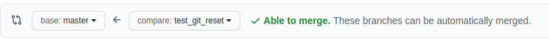

# Guidelines


## Premise
1. Pentru lucrul cu git vom folosi [Git Bash](https://git-scm.com/downloads) drept linie de comandă.

## Git Workflow
1. Clonare repository

```bash
      git clone https://github.com/<utilizator>/<proiect>.git
```

2. Creare branch - Vedeti cum se denumesc branch-urile!

```bash
      git checkout -b branch_name
```

3. Aduceti modificarile personale codului
4. Creati un commit cu modificările aduse

```bash
      git add .
      git commit -s
```

5. Actualizați pe server modificările făcute local

```bash
      git push origin <nume_branch>
```

6. Din interfața Github, faceți un Pull Request prin care să cereți integrarea branch-ului vostru pe branch-ul principal.

## Git FAQ

0. Cum creez un repository de la zero?
  - Creem un repository local
```bash
	mkdir <locație_proiect>
	cd <locație_proiect>
	git init
```
  - Creem un repository pe GitHub/GitLab
    - Accesăm platforma web aleasă(GitHub - https://github.com, GitLab - https://gitlab.com)
	- Ne autentificăm pe platformă(dacă nu aveți cont, vă puteți crea unul)
	- Creați repository-ul(Ar trebui să găsiți în platformă un buton **New** sau **New Repository**
	- Specificați un nume pentru proiect, dacă preți să poată fi accesat de oricine(__public__) sau doar de membri aleși de voi(__private__) și creați repository-ul
	- Pagina pe care ați fost direcționați reprezintă pagina principală a proiectului. Puteți folosi acest link pentru a face referire la proiect. Link-ul poate fi obținut și de pe pagina proiectulu(Ex. Butonul **Code** de pe github).
  - Facem legătura între repository-ul local și cel de pe platforma online
```bash
	git remote add origin https://github.com/username/project_name
	git push -u origin master
```
2. Trebuie neapărat să imi fac un branch nou dacă vreau să lucrez cu Git?
Nu este necesar să creați branch-uri noi. Puteți folosi branch-ul implicit(master sau main). Totuși, în cazul în care lucrează mai multe persoane în cadrul aceluiași proiect, este recomandat să se lucreze pe mai multe branch-uri, fiecare branch reprezentând o anumită sarcină(task).

3. Ce este un branch?
Un branch reprezintă o direcție de dezvoltare sau, altfel spus, o versiune a proiectului. Astfel, dacă avem mai multe branch-uri putem avea în paralel mai multe versiuni ale proiectului. Astfel, mai mulți dezvoltatori pot lucra în paralel, fiecare cu versiunea lui(versiune care pleacă dintr-o rădăcină comună cu celelalte), iar când termină de lucrat, poate integra aceste modificări în branch-ul(versiunea) principală a proiectului. 
```bash
# Mutare de pe un branch pe altul
$ git checkout branch2

# Creare și mutare pe un branch nou
$ git checkout -b branch_nou

# Ștergere branch
$ git branch -d branch
```

4. Am făcut modificări pe un branch. Cum le pun pe server? (GitHub, Gitlab, etc.)

```bash
	cd <locație_proiect>
	git add <listă_de_fișiere_sau_foldere_pe_care_vreau_să_le_salvez_în_proiect>
	git commit -s    # Introduc mesaj, salvez și închid editor text
	git push origin <nume_branch_pe_care_am_lucrat>
```

5. Am pus modificările pe server, pe branch-ul meu. Cum le integrez pe master?

R: Mă autentific pe site(github.com), merg pe pagina repository-ului, în tab-ul PULL REQUESTS(sau MERGE REQUESTS). Dau click pe `New Pull Request`. Selectez branch-ul meu ca sursă și branch-ul master ca destinație.



6. Am urmat pasul 2, dar branch-urile au conflicte și nu pot fi merge-uite automat. Ce fac?

```bash
	cd <locație_proiect>
	git checkout <nume_branch>
	git fetch --all
	git rebase origin/master
	git push -f origin <nume_branch>
```

7. Când fac rebase/merge imi apar conflicte. Ce fac acum?

Varianta 1 - Folosind terminalul
  - Deschideti terminalul(sau Git Bash)
  - Folosind ``cd`` navigați în locația proiuectului
  - Generați o listă cu fișierele în care apar conflictele

```bash
$ git status
> # On branch branch-b
> # You have unmerged paths.
> #   (fix conflicts and run "git commit")
> #
> # Unmerged paths:
> #    (use "git add ..." to mark resolution)
> #
> # both modified:      sursa1.cpp
> #
> no changes added to commit (use "git add" and/or "git commit -a")
```

  - Deschideți fișierul cu probleme(în cazul nostru ``sursa1.cpp``) folosind un editor text.
	  - Identificați locația conflictului din fișier. Puteți identifica începutul conflictului după markerul ``<<<<<<<``. Conflictul poate fi interpretat astfel: Cele două branch-uri pe care vrem să le unim, modifică aceleași lucruri din fișier, iar clientul de git nu știe care dintre cele două modificări trebuie să rămână. Astfel, în fișier este marcat cu ``<<<<<<< HEAD`` începutul modificărilor de pe branch-ul de bază, cu ``=======`` sfârșitul acestora și începutul modificărilor de pe celălalt branch, iar cu ``>>>>>>> BRANCH-NAME`` sfârșitul acestora.

  - Pentru rezolvarea manuală a conflictelor, se va lăsa fișierul în starea finală dorită(se vor șterge markerele amintite mai sus, se vor șterge modificările nedorite, sau se va adăuga, după caz, elemente care vrem să facă parte din fișierul respectiv după integrarea modificărilor).

Exemplu de conflict:
```bash
int function()
{
<<<<<<
    int a;
=======
    unsigned int a;
>>>>>>>
    for (a = 0; a < 10; a++)
	{
```

Exemplu de conflict rezolvat:

```bash
int function()
{
    unsigned int a;
    for (a = 0; a < 10; a++)
	{
```
  - Salvbare modificări
```bash
git add sursa1.cpp

```

8. După ce a fost aprobat Pull Request-ul și am integrat modificările de pe branch, pot șterge branch-ul inițial?

R: Da. Chiar este recomandat, pentru a nu încărca inutil repository-ul.

## Comenzi rapide
0. Afișare stare repository

```bash
	git status
```

1. Afișare istoric commit-uri (GUI)

```bash
		gitk --all
```

2. Afișare istori commit-uri (CLI)

```bash
		git log
		git log --pretty=oneline
```

3. Creare branch nou

```bash
		git checkout -b <nume_branch>
		git branch <nume_branch>
```

4. Resetare vârf branch

```bash
		git reset --soft <commit_id> # Păstrează diif cu starea curentă
		git reset --hard <commit_id> # Se resetează fără păstrare modificări
```

5. Creare etichetă(versiune)

```bash
		git tag v0.1
```

## Git Conventions

### Mesajul de commit

Mesajul de commit ar trebui să descrie modificările făcute de voi în commit-ul respectiv. Ar trebui să arate ca mai jos:

```bash
    Implementează system de gestiune al excepțiilor

    Issue: #22
    Implementează clasele:
      Exception: Interfață management general de exceptii

    Metoda type() întoarce tipul de exceptie

    Signed-off-by: Dan Avram <dan.avram@mta.ro>
```

#### Componență:

1. Prima linie(titlul commitului) rezuma commit-ul. Conține maxim 50 de caractere.

2. Linia a doua trebuie să fie goală

3. Linia a treia specifică Issue-ul la care face referire commit-ul. Fiecare commit trebuie să facă referire la un Issue.

4. Descrierea pe larg a commit-ului. Fiecare linie nu trebuie să depășească 72 de caractere.

5. La final, semnătura(se generează automat la comanda ```git commit -s```

### Denumirile branch-urilor
Branch-urile trebuie denumite in funcție de componenta la care se lucreaza si numarul issue-lui: ```issue-22-implementare-exceptii```
